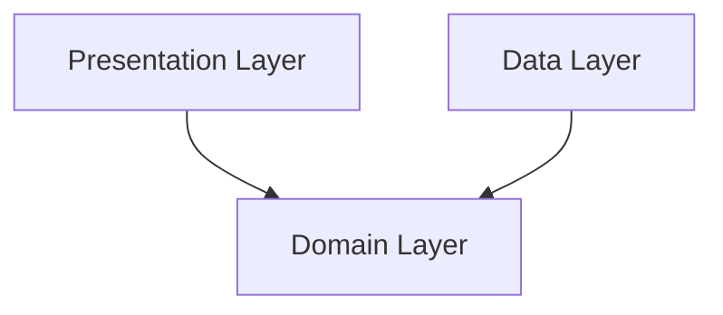
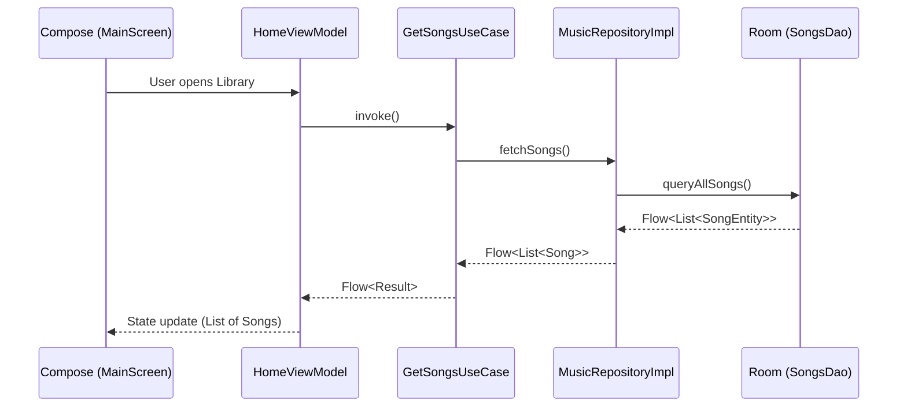

# MusicPlayer

A beautiful, feature-rich offline music player built with modern Android development practices, highlighting Jetpack Compose, Clean Architecture, and Material 3 Expressive design.

[](https://kotlinlang.org)
[](https://developer.android.com)
[](https://opensource.org/licenses/MIT)
[](https://developer.android.com/jetpack/compose)

[//]: # (<p align="center">)

[//]: # (  <!-- TODO: Replace placeholder paths with actual screenshot paths -->)

[//]: # (  )

[//]: # (  )

[//]: # (  )

[//]: # (  )

[//]: # (</p>)

## Features

An elegant array of capabilities tailored for offline media playback and library management, discovered directly from the project's robust architecture.

| Core Playback                                                                                        | Library Management                                                                                |
|:-----------------------------------------------------------------------------------------------------|:--------------------------------------------------------------------------------------------------|
| **Media3 ExoPlayer Integration:** Background playback, custom commands, and a media session service. | **Offline Media Scanning:** Uses MediaStore and Room to automatically catalog local device audio. |
| **Queue Management:** Reorder and manage the current playing queue with drag-and-drop support.       | **Rich Metadata Editing:** Built-in metadata editor powered by JAudioTagger to fix IDs and tags.  |
| **Playback Timers:** Integrated sleep timer and playback parameters adjustments.                     | **Playlists:** Seamlessly create, rename, and add tracks to custom playlists.                     |

| UI & UX                                                                                                                        | Widgets & Extras                                                                              |
|:-------------------------------------------------------------------------------------------------------------------------------|:----------------------------------------------------------------------------------------------|
| **Material 3 Expressive:** Utilizes modern layout schemes featuring expressive rect shapes and dynamic color (Material Kolor). | **Glance Home Widgets:** Offers Small, Medium, and Large widgets directly on the home screen. |
| **Adaptive Layouts:** Supports distinct Large and Small player screens, grids, and list views.                                 | **Ktor Integration:** Remote artist picture fetching using Ktor Client.                       |
| **Custom Animations:** Wavy slider implementation and animated counter text for playback progress.                             | **WorkManager Support:** Background tasks for media library synchronizations and updates.     |

## Tech Stack & Architecture

### Tech Stack

| Category                 | Library                  | Version      |
|:-------------------------|:-------------------------|:-------------|
| **Language**             | Kotlin                   | 2.3.20       |
| **UI Toolkit**           | Jetpack Compose (BOM)    | 2026.03.00   |
| **Navigation**           | Navigation3 Runtime / UI | 1.1.0-beta01 |
| **Dependency Injection** | Koin for Android         | 4.2.0        |
| **Database**             | Room                     | 2.8.4        |
| **Network**              | Ktor Client              | 3.4.1        |
| **Image Loading**        | Coil Compose             | 2.7.0        |
| **Media Playback**       | Media3 ExoPlayer         | 1.9.3        |
| **Home Widgets**         | Glance AppWidget         | 1.1.1        |

### Architecture Deep-Dive

Clean Architecture was chosen for this media player to strictly decouple the persistent media index (Room), background service controls (Media3), and the responsive UI, preventing ANRs and ensuring deterministic state handling across the app structure. Multiple Koin modules (`DatabaseModule`, `RepoModule`, `UseCaseModule`, etc.) provide segmented dependency graphs.



*   **Domain Layer:** Holds Kotlin-only business logic containing models (`Song`, `Album`, `Playlist`), dedicated use cases (`GetSongsUseCase`, `HandlePlayerEventUseCase`), and interfaces (`MusicRepository`, `PlayerRepository`).
*   **Data Layer:** Interfaces with local data via Room DAOs (`SongsDao`, `AlbumsDao`), MediaStore scanners, and handles remote artist image fetching with Ktor (`ArtistsPictureFetcher`).
*   **Presentation Layer:** Powered by Compose and Navigation3, containing ViewModels like `HomeViewModel` and `PlayerViewModel`, which observe domain state flows and dispatch UI actions. 

### Data Flow



## Getting Started

Follow these steps to explore and run the project locally.

**Prerequisites:**
*   Android Studio Ladybug (or newer, capable of supporting AGP 9.1.0 and Kotlin 2.3.20).
*   JDK 21 configured in your IDE.

**Setup Instructions:**
1.  Clone the repository:
    ```bash
    git clone https://github.com/YounesBouhouche/MyMusicPlayer.git
    ```
2.  Open the project directory in Android Studio.
3.  Ensure your SDKs are installed up to API level 36.
4.  Run a gradle sync.
5.  Select either the `debug`, `staging`, or `release` build variant.
6.  Connect a physical device via ADB or start an emulator running API 30+ (recommended API 33+ for latest Android media notification layouts).
7.  Click Run (Shift + F10).

## Project Structure

A clean encapsulation of features utilizing a core-and-feature module grouping layout inside the single `app` module namespace.

```text
app/src/main/java/younesbouhouche/musicplayer/
├── core/           # Shared database, repositories, models, and UI themes
├── di/             # Koin module definitions by layer and feature
├── features/       
│   ├── dialog/     # Shared dialog components and repositories
│   ├── glance/     # Home screen app widget implementation
│   ├── main/       # Primary UI routes (home, library, playlist, metadata)
│   ├── permissions/# Runtime permission handling logic
│   ├── player/     # MediaSession service, ExoPlayer management, custom commands
│   └── settings/   # User preferences (theme, language, playback)
└── navigation/     # AppNavGraph and main scene transition logic
```

## Contributing

We welcome contributions to improve the media layer, UI design, and translations!

1.  Fork the repository and clone it to your machine.
2.  Create a feature branch using the format `feature/your-feature-name` or `fix/issue-description`.
3.  Ensure your code passes ktlint checks (already integrated as a gradle plugin).
4.  Submit a Pull Request and detail the changes you have made.
5.  Check the [Issues](#) tab to find tasks labeled as `good first issue`.

## License

This project is licensed under the MIT License. See the `LICENSE` file for details.
